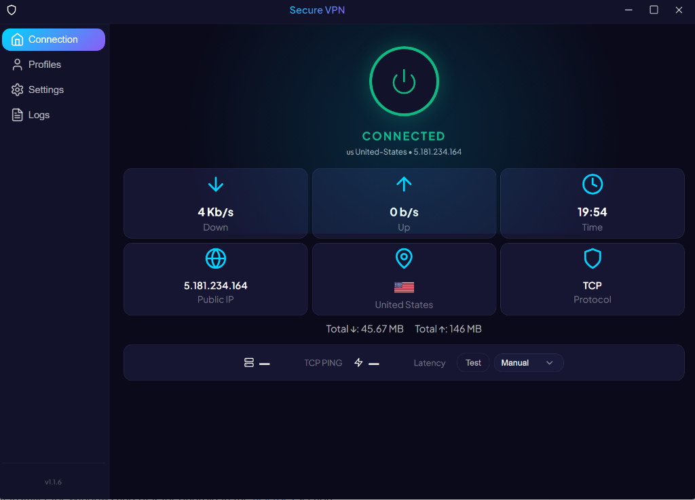
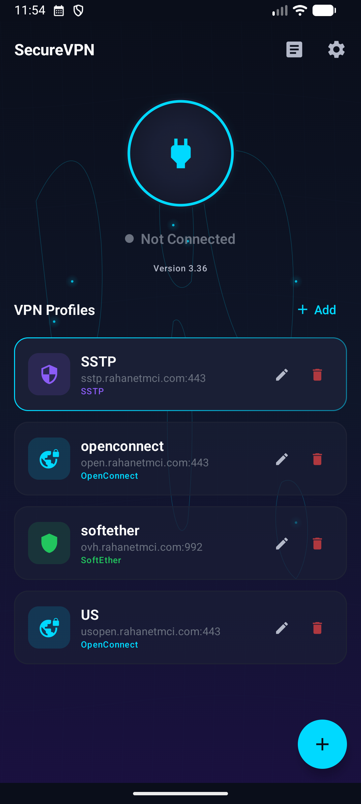
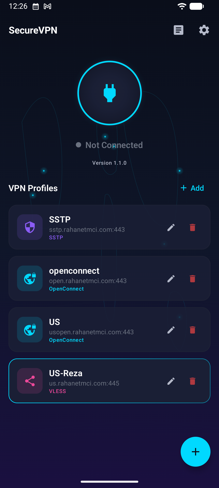

# SecureVPN

SecureVPN is a premium, high-performance, multi-protocol VPN application designed for **Windows** and **Android**. Built with modern technologies (Electron/React for Windows, Jetpack Compose for Android) and powered by highly optimized core network engines.

---

## 📸 Screenshots

  

  
  

---

## 🚀 Key Features

- **Multi-Protocol Support:**
  - **OpenConnect / Cisco AnyConnect:** Extremely stable enterprise tunnel.
  - **SSTP (Secure Socket Tunneling Protocol):** Native Windows integration with SSL encapsulation.
  - **SoftEther:** Dual-stack support with robust throughput.
  - **V2Ray/Xray Engines:** Complete support for VLESS, VMess, Trojan, and Shadowsocks.
- **Dynamic Subscription Management:** 
  - Paste subscription links (V2Ray format).
  - Automatically parse upload, download, limit, and expire info from headers.
  - Periodic refresh and auto-sync of proxy servers.
- **Zero-Latency DNS (FakeIP Mode):**
  - Instant (0ms) local DNS resolution for proxy connections.
  - Real domain resolution is offloaded to the VPN server, bypassing local ISP 8.8.8.8 and DNS filtering.
  - Speeds up YouTube video buffering and heavy ad-network domain loading.
- **High-Performance Network Stack:**
  - Support for **Mixed Stack Mode** (TCP runs natively through the Windows/Android kernel, UDP runs inside gVisor for gaming/voice chat compatibility).
  - Configurable MTU sizes and network buffer allocations.
- **Beautiful Premium UI:**
  - Vibrant dark mode styling, subtle gradients, and sleek transitions.
  - Instant connection stats, upload/download speed monitoring, and latency checks.

---

## 🛠 Tech Stack

- **Windows Desktop App:** React, TypeScript, Electron, Vite, Tailwind CSS (Vanilla CSS components), sing-box core.
- **Android App:** Kotlin, Jetpack Compose, Kotlin Coroutines, SharedPreferences, libbox core.
- **Core Engine:** sing-box (v1.13.14+).

---

## 📦 Releases & Installation

Get the latest installer for Windows and APK for Android in the [Releases](https://github.com/morezaGeek/SecureVPN/releases) section.
